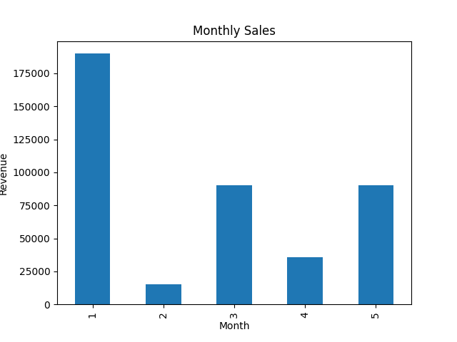
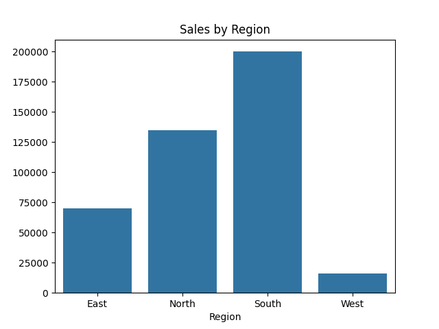
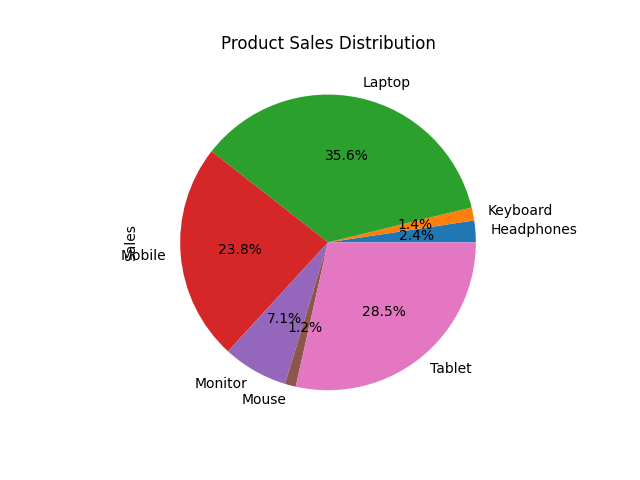

# 📊 Sales Data Analysis Using Python

## 📌 Project Overview

This project performs **Sales Data Analysis using Python** to extract meaningful insights from a sales dataset. The analysis helps understand sales performance, product demand, and regional sales trends.

Using Python libraries such as **Pandas, NumPy, Matplotlib, and Seaborn**, the project demonstrates the complete **data analysis workflow**, including data loading, cleaning, analysis, and visualization.

---

# 🎯 Project Objectives

The main goals of this project are:

* Analyze **total revenue generated from sales**
* Identify **best-selling products**
* Understand **monthly sales trends**
* Compare **region-wise sales performance**
* Generate **business insights using data visualization**

---

# 🛠️ Technologies Used

* Python
* Pandas
* NumPy
* Matplotlib
* Seaborn
* Google Colab / Jupyter Notebook
* GitHub

---

# 📂 Project Structure

```
sales-data-analysis
│
├── sales_data_analysis.ipynb
├── sales_data.csv
├── README.md
│
└── images
    ├── monthly_sales.png
    ├── region_sales.png
    └── product_sales.png
```

---

# 📊 Dataset Description

The dataset contains sales transaction information with the following columns:

| Column   | Description             |
| -------- | ----------------------- |
| OrderID  | Unique order ID         |
| Date     | Date of the order       |
| Region   | Sales region            |
| Product  | Product name            |
| Category | Product category        |
| Quantity | Number of products sold |
| Price    | Price per product       |
| Customer | Customer name           |

---

# 🔎 Project Workflow

## 1️⃣ Data Loading

The dataset is loaded using **Pandas**.

```python
import pandas as pd

df = pd.read_csv("sales_data.csv")
df.head()
```

---

## 2️⃣ Data Exploration

Understanding the dataset using:

* Dataset shape
* Data types
* Summary statistics

```python
df.info()
df.describe()
```

---

## 3️⃣ Data Cleaning

Convert the Date column into datetime format.

```python
df['Date'] = pd.to_datetime(df['Date'])
```

---

## 4️⃣ Feature Engineering

Create a new column **Sales** to calculate total revenue.

```python
df['Sales'] = df['Quantity'] * df['Price']
```

---

## 5️⃣ Data Analysis

### Total Revenue

```python
total_sales = df['Sales'].sum()
print(total_sales)
```

### Best Selling Products

```python
product_sales = df.groupby('Product')['Sales'].sum()
```

### Region-wise Sales

```python
region_sales = df.groupby('Region')['Sales'].sum()
```

### Monthly Sales Trend

```python
df['Month'] = df['Date'].dt.month
monthly_sales = df.groupby('Month')['Sales'].sum()
```

---

# 📈 Data Visualization

## Monthly Sales Trend



---

## Region Wise Sales



---

## Product Sales Distribution



---

# 📌 Key Insights

From the analysis we observed:

* Electronics products generated the **highest revenue**
* Laptop is among the **top-selling products**
* The **North region** shows strong sales performance
* Sales increase in later months indicating **business growth**

These insights can help businesses make **data-driven decisions**.

---

